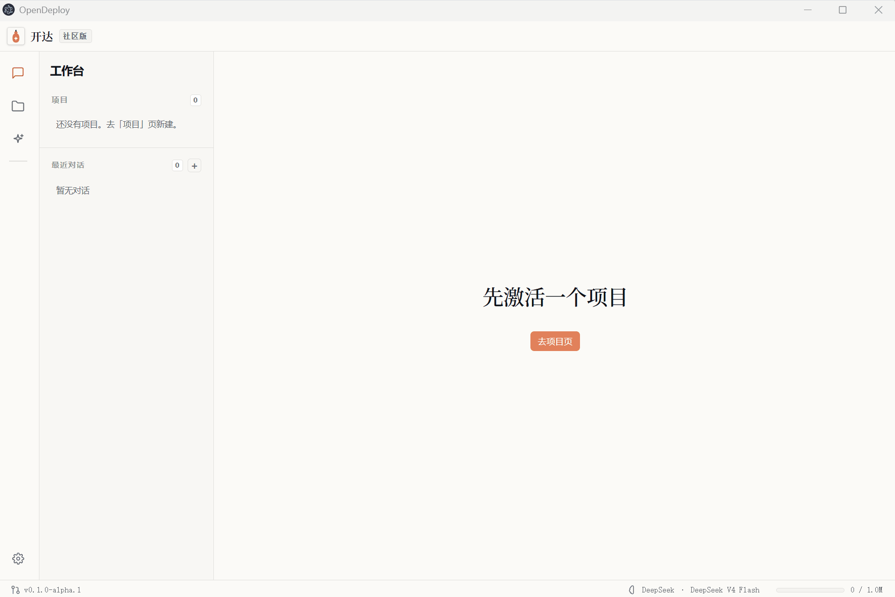

<p align="center">
  
</p>

<h1 align="center">开达 OpenDeploy</h1>

> 面向 ERP 实施顾问的开源 AI 智能体 —— 让"一个人的交付团队"成为可能。

[English](./README.md) | [简体中文](./README.zh-CN.md)

---

大部分 "AI 辅助工具" 现在长这样:

> **顾问**: 客户要加个 xxx 功能
>
> **AI**: 好,我帮你写 Python 插件
>
> **顾问**: ……但字段得先在系统里建,审批流也得改
>
> **AI**: 那个你自己去配

**开达想做的是: 这一整串,AI 全干。**

## 演示

<p align="center">
  
  <br/><sub>首次配置 —— 配置你的 LLM</sub>
</p>

<p align="center">
  
  <br/><sub>创建项目 —— 接入金蝶云星空 V9</sub>
</p>

<p align="center">
  
  <br/><sub>真实定制闭环 —— 业务需求 → 插件落地</sub>
</p>

## 已支持的功能

**LLM 适配**(自带 API Key 即用):Claude · GPT · DeepSeek · Qwen · GLM · Kimi · 豆包 · 混元 · MiniMax · 百川 · Ollama 本地

**金蝶云星空 V9 二开**(全程走 BOS HTTP RPC,不接客户数据库):

- 扩展生命周期 —— 新建 / 删除 / 列举
- 字段 —— 12 类(文本 / 数值 / 金额 / 数量 / 日期 / 复选 / 下拉 / 基础资料 / 助记码 / 计量单位 / 公式 / 物料属性等)
- 单据体 —— EntryEntity / TabPage / TabControl 的 创建 / 删除 / 改名
- Python 表单插件 —— 批量挂载,产物落项目目录
- 业务规则 —— Calculate / GetInvStock 等
- 自定义操作 + 工具栏按钮
- 单据转换规则 —— 扩展 + 转换插件
- 属性面板 —— 必填 / 默认值 / 显示行号 / 组织字段绑定 / 实体必填

**知识库**(10 个 skill / 57 份 markdown / 10638 行,GitHub 直拉,Gitee 镜像兜底):实施流程方法 + 二开决策树 + BOS 各类元素手册 + 客户实证案例

**架构**:零自营服务器 · 凭据全部本地(明文存 `settings.json`,renderer 进程不接触)· 单顾问本地工具

## 怎么开始

需要 Windows 10/11 + 一个 LLM API Key。

```bash
pnpm install
pnpm dev
```

v0.1 Alpha 会提供现成安装包。

## 当前状态

开发中,v0.1 Alpha 前夕。

- 目标: 金蝶云星空 V9 私有部署版
- 10 个 skill / 57 份 markdown / 10638 行行业知识

## 开源协议

MIT —— 详见 [LICENSE](./LICENSE)
