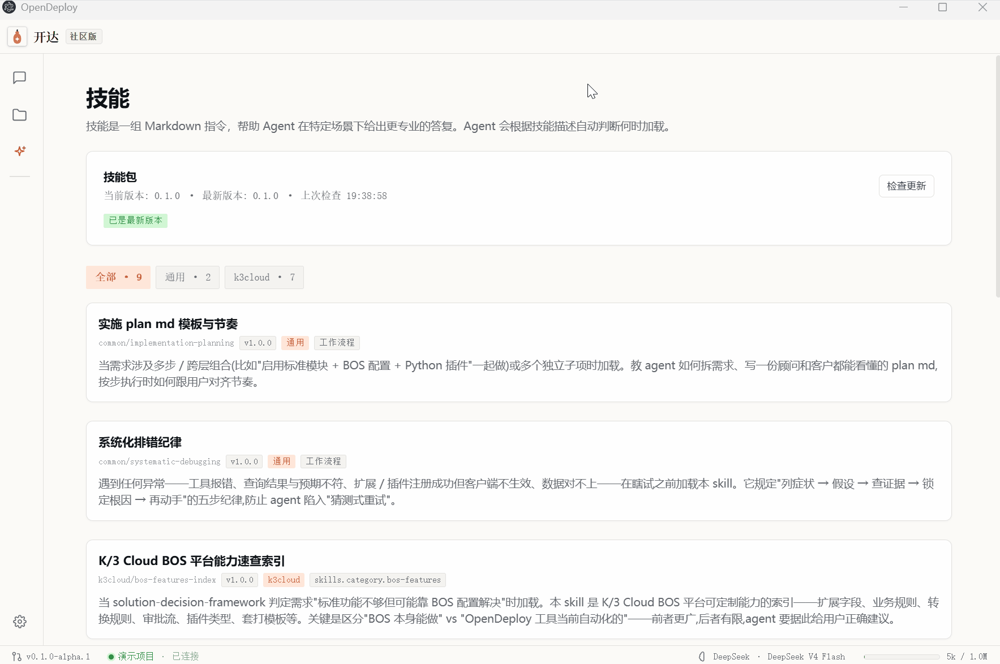

<p align="center">
  
</p>

<h1 align="center">开达 OpenDeploy</h1>

> 面向 ERP 实施顾问的开源 AI 智能体 —— 让"一个人的交付团队"成为可能。

[English](./README.md) | [简体中文](./README.zh-CN.md)

---

大部分 "AI 辅助工具" 现在长这样:

> **顾问**: 客户要加个 xxx 功能
>
> **AI**: 好,我帮你写 Python 插件
>
> **顾问**: ……但字段得先在系统里建,审批流也得改
>
> **AI**: 那个你自己去配

**开达想做的是: 这一整串,AI 全干。**

## 演示

<p align="center">
  
  <br/><sub>首次配置 —— 配置你的 LLM</sub>
</p>

<p align="center">
  
  <br/><sub>创建项目 —— 接入 金蝶云星空 标准版/企业版 V9</sub>
</p>

<p align="center">
  
  <br/><sub>Skills 知识库 —— 实施方法论 + BOS 手册按需加载</sub>
</p>

<p align="center">
  
  <br/><sub>真实定制闭环 —— 业务需求 → 插件落地</sub>
</p>

## 已支持的功能

**LLM 适配**(自带 API Key 即用):Claude · GPT · DeepSeek · Qwen · GLM · Kimi · 豆包 · 混元 · MiniMax · 百川 · Ollama 本地

**金蝶云星空 V9 二开**(全程走 BOS HTTP RPC,不接客户数据库):

- **新建 metaobject(BOS 模板继承)** —— 27 个模板覆盖 4 大 ModelType(单据 / 基础资料 / 账表 / 动态表单),wire 等价 BOS Designer "新建向导 → 模板继承"(**v0.2 新增**)
- 扩展生命周期 —— 新建 / 删除 / 列举
- 字段 —— 12 类(文本 / 数值 / 金额 / 数量 / 日期 / 复选 / 下拉 / 基础资料 / 助记码 / 计量单位 / 公式 / 物料属性等)
- 单据体 —— EntryEntity / TabPage / TabControl 的 创建 / 删除 / 改名
- Python 插件 —— 表单插件(30+ 事件)、列表插件、操作服务插件、账表服务端插件,批量挂载,产物落项目目录
- 业务规则 —— Calculate / GetInvStock 等
- 自定义操作 + 工具栏按钮 + 列表菜单按钮
- 单据转换规则 —— 通用化覆盖任意源/目标对象,扩展 + 转换插件
- 属性面板 —— 必填 / 默认值 / 显示行号 / 组织字段绑定 / 实体必填

**知识库**(11 个 skill / 67 份 markdown / 14933 行,GitHub 直拉,Gitee 镜像兜底):实施流程方法 + 二开决策树 + BOS 各类元素手册 + 客户实证案例

**架构**:零自营服务器 · 凭据全部本地(明文存 `settings.json`,renderer 进程不接触)· 单顾问本地工具

## 怎么开始

需要 Windows 10/11 + 一个 LLM API Key。

**下载安装包(推荐)**

[**👉 v0.2.6-alpha 安装包**](https://github.com/qiaolei227/opendeploy/releases/latest) —— 下载 `OpenDeploy-*-x64-setup.exe` 双击安装。

**本地开发**

```bash
pnpm install
pnpm dev
```

## 当前状态

**v0.2.6-alpha 已发布** —— 连接可靠性修复(issue #7)。当 K/3 账号密码**硬过期**时,登录返回的提示之前被 OpenDeploy 误当成"连接成功",于是拿到一个**未认证的会话**,后续每个元数据 / 写入 RPC 都被服务端拒,报一句很费解的 `401 Forbidden ByRspRetStatusCode -- N001: Unexpectable request`(再被二次包装成更费解的 `K/3 RPC body is not valid JSON`)。结果项目显示**已连接**,但每个操作都静默失败。本次:(1) 把硬过期密码当作连接**失败**,给出明确的"请重置密码后再连接"提示,而不是连上一个死会话;(2) 识别这种服务端拒绝报文,报出真因——会话未完整认证 / 登录不完整——不再误报 JSON 解析错误;(3) 修好登录验证码流程:验证码图改从把码写进**登录所读的同一个服务端 session** 的 kdsvc 端点取(旧的 `ValidateCode.ashx` 用的是另一套 session,输对了码也对不上),并改用原生 WPF 客户端类型。相对 v0.2.5-alpha 无 ERP 覆盖面变化。前序: v0.2.5-alpha (Token Plan) → v0.2.4-alpha → v0.2.3-alpha → v0.2.2-alpha → v0.2.1-alpha → v0.2.0-alpha。面向 BOS 二开顾问的内部预览版, 功能 / API / UX 仍可能变动。

- 目标: 金蝶云星空 V9 私有部署版(标准版 / 企业版,V8 暂不兼容 —— 登录协议差异)
- 平台: 仅 Windows x64(macOS / Linux 视用户反馈)
- 11 个 skill / 69 份 markdown / 15310 行行业知识
- 919 单元/wire-replay 测试,lint clean,真服务器 smoke + agent loop e2e 全覆盖

## 开源协议

MIT —— 详见 [LICENSE](./LICENSE)
